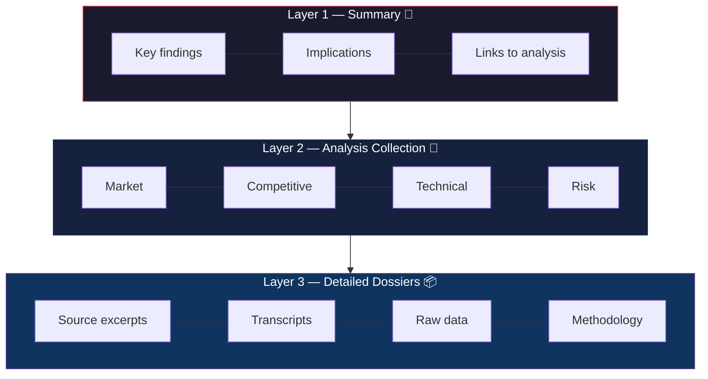

# Artifact Pyramids

**Progressive disclosure for what AI agents produce — Summary → Analysis Collection → Dossiers.**

The Artifact Pyramid is a structured methodology for organizing AI agent research outputs across three layers of increasing depth. Just as progressive disclosure governs how we feed agents context, the Artifact Pyramid governs what they produce — enabling downstream agents and humans to consume at the depth they need.

| Layer | What it contains | Who consumes it |
|-------|-----------------|-----------------|
| **L1: Summary** | Research question, key findings, implications (one file) | PM agents, executives, quick scanners |
| **L2: Analysis Collection** | Per-dimension files (market, competitive, technical, risk) | Analysts, domain-specific agents |
| **L3: Detailed Dossiers** | Source excerpts, transcripts, raw data, methodology | Validators, deep-dive researchers |



## Why?

Current AI agent workflows use progressive disclosure on the **input side** (metadata → instructions → resources) but produce flat, monolithic outputs on the **output side**. The Artifact Pyramid fixes this asymmetry, making agent outputs:

- **Independently consumable** at every layer of fidelity
- **Bidirectionally traceable** from published claim back to source
- **Pipeline-friendly** for multi-agent research workflows
- **Quality-gated** at each transformation step

## Quick Start

```bash
# Check pyramid health of a research project
scripts/pyramid-status.sh ./my-project

# Extract candidate atoms from a source file
scripts/extract-atoms.py source.txt --source-id paper-001 --domain scaling-laws

# Scaffold a new research project
cp assets/pyramid-template.md ./my-project/00-index.md
```

## Repository Structure

```
artifact-pyramids/
├── SKILL.md                    # Agent Skills-compliant skill (loadable by AI agents)
├── README.md                   # This file
├── LICENSE                     # MIT
├── scripts/
│   ├── pyramid-status.sh       # Audit a project directory for structural coverage
│   └── extract-atoms.py        # Extract atomic claims from source text
├── references/
│   ├── artifact-pyramid-framework.md   # Full conceptual foundation
│   ├── pipeline-stages.md              # Detailed layer definitions and navigation format
│   ├── quality-gates.md                # Verification criteria at each layer
│   └── synthetic-example.md            # Complete walked-through example (synthetic data)
└── assets/
    ├── pyramid-template.md             # Project scaffold template
    └── artifact-inventory.md           # Cross-layer tracking template
```

## For AI Agents

This repo ships as an [Agent Skills](https://agentskills.io)-compliant skill. To load it in Hermes Agent:

```bash
git clone https://github.com/groktopus/artifact-pyramids ~/.hermes/skills/artifact-pyramids
```

Then any session with the skill loaded can call `skill_view(name='artifact-pyramids')` to activate it.

## The Three Layers

| Layer | Contents | Consumed By | Who Produces |
|-------|----------|-------------|--------------|
| **L1: Summary** | One file — research question, key findings, implications. Links to L2 analysis files. | PM agents, executives, quick scanners | Researcher synthesizes from L2 |
| **L2: Analysis Collection** | Per-dimension files — market, competitive, technical, risk. Self-contained, links to L3 | Domain specialists, analyst agents | Analyst extracts from L3 dossiers |
| **L3: Detailed Dossiers** | Source excerpts, raw data tables, transcripts, methodology notes | Validators, deep-dive agents | Collector captures from primary sources |

## License

MIT
