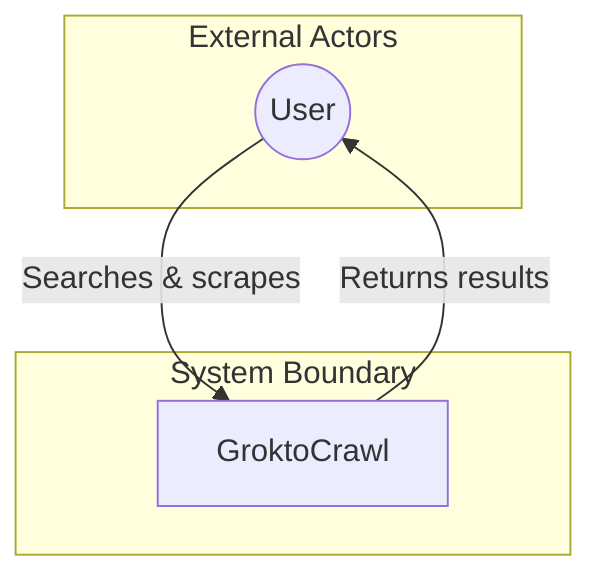
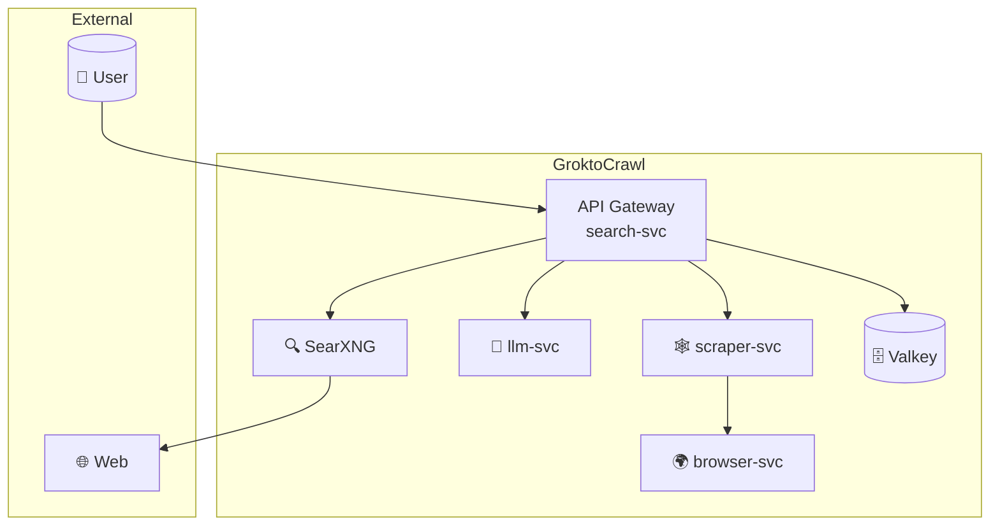
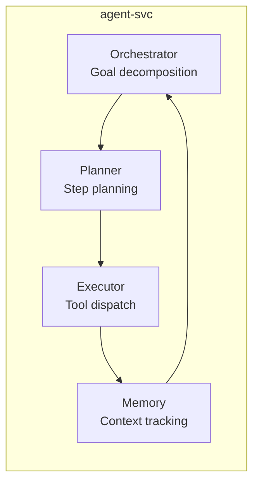

# C4 Model with Mermaid

Mermaid does NOT have stable native C4 syntax. `C4Context` and `C4Container` are experimental and unreliable. For production C4 diagrams, use **Structurizr DSL**. For inline markdown where Structurizr isn't available, use the flowchart workaround below.

## Option 1: Structurizr DSL (Recommended)

Structurizr is the canonical C4 tool. The DSL compiles to Mermaid, PlantUML, or Structurizr's own diagram format.

```dsl
workspace {
  model {
    user = person "User" "A user of the system"
    system = softwareSystem "GroktoCrawl" "Self-hosted Firecrawl alternative"
    user -> system "Uses"
  }
  views {
    systemContext "SystemContext" {
      include *
      autoLayout
    }
  }
}
```

Render with:
```bash
# Via Structurizr CLI
java -jar structurizr-cli.jar render -w workspace.dsl -f mermaid -o output/

# Or use the structurizr-site-generatr for full documentation site
```

## Option 2: Flowchart Workaround (For Inline Markdown)

Use Mermaid flowchart subgraphs with styling to approximate C4 views. The pattern uses two boxes per element (one for the system/person, one for a description).

### System Context (L1)



### Container Diagram (L2) — Multi-service stack



### Component Diagram (L3) — Inside a service



## Limitations

- No native C4 shapes (person, system, container, database) — must approximate with subgraphs
- No automatic layout — manual positioning via subgraph nesting
- No relationship descriptions on edges (can add via edge labels)
- Structurizr DSL is the right tool for C4. Use Mermaid flowchart workarounds only when Structurizr is unavailable.
