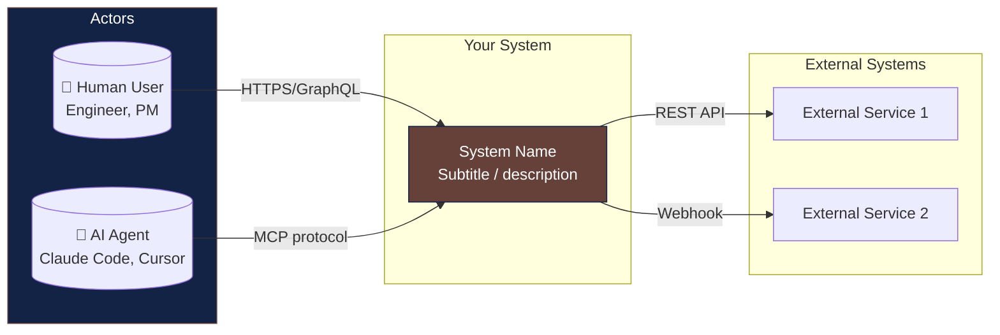
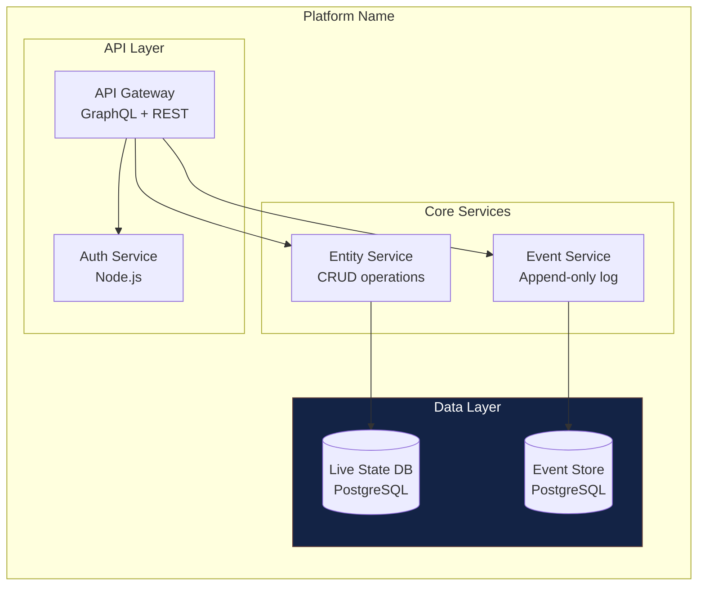
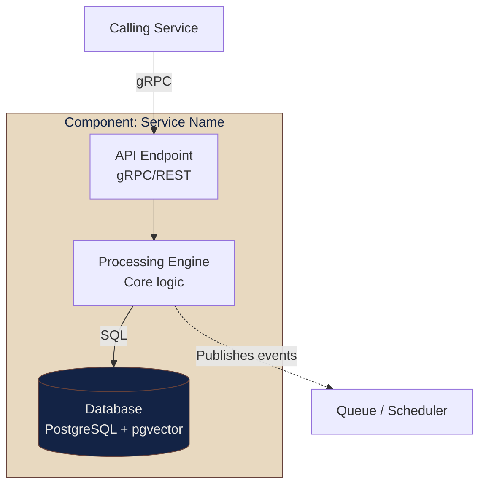

# C4 → Flowchart Conversion for GitHub-Compatible Mermaid

GitHub's built-in mermaid renderer does **not** support the C4 plugin types (`C4Context`, `C4Container`, `C4Component`, `C4Deployment`, `C4Dynamic`). These render as raw code blocks. Convert them to standard `flowchart` syntax to get working diagrams on GitHub, PR previews, and most markdown renderers.

## Conversion Table

| C4 Element | Flowchart Equivalent | Example |
|-----------|---------------------|---------|
| `Person(label, "Name", "Desc")` | `LABEL["Name<br/>Desc"]` | `U["Human User<br/>Engineer, PM"]` |
| `System(label, "Name", "Desc")` | `LABEL["Name<br/>Desc"]` with style | `GP["GroktoPlan<br/>Temporal KG"]` — add `style GP fill:#...` |
| `System_Ext(label, "Name", "Desc")` | `LABEL["Name<br/>Desc"]` outside main subgraph | `GIT["Git Providers"]` in External subgraph |
| `Container(label, "Name", "Tech", "Desc")` | `LABEL["Name<br/>Tech Stack"]` | `KG["Knowledge Graph<br/>Python + pgvector"]` |
| `ContainerDb(label, "Name", "Tech")` | `LABEL[("Name<br/>Tech")]` (cylinder parens) | `KGD[("Knowledge Graph DB<br/>pgvector")]` |
| `Db(label, "Name", "Tech")` | `LABEL[("Name<br/>Tech")]` (cylinder parens) | `LS[("Live State DB<br/>PostgreSQL")]` |
| `System_Boundary(name, "Title") { ... }` | `subgraph Title["Title"] ... end` | Nested subgraph |
| `Container_Boundary(name, "Title") { ... }` | `subgraph Title["Title"] ... end` | Single subgraph |
| `Rel(from, to, "label", "tech")` | `FROM -- "label" --> TO` | `AR -- "gRPC" --> GA` |
| `Rel(from, to, "label")` (async) | `FROM -.->|"label"| TO` | `EV -.->|"feeds"| KG` |
| `UpdateLayoutConfig($key="val")` | Omit. Set direction in `flowchart LR`/`TB` | `flowchart LR` or `flowchart TB` |

## Worked Example 1: System Context (C4Context → flowchart LR)



## Worked Example 2: Container Diagram (C4Container → flowchart TB)



## Worked Example 3: Component Diagram (C4Component → flowchart TB)



## When to Use Which Approach

| Context | Approach | Reason |
|---------|----------|--------|
| GitHub README/PR/MD | Flowchart conversion | Only approach that renders inline |
| Formal ADR / arc42 document | Structurizr DSL | Full C4 fidelity, SVG export |
| PDF report | Pre-rendered SVG (from either approach) | No JS execution in PDF pipeline |
| Internal wiki (non-GitHub) | Depends on platform's mermaid support | Test C4 syntax first |
| Architecture artifact pyramid | Hybrid: Structurizr for L3, flowchart for L1 inline | Depth where needed, readability where consumed |

## Pitfalls

- **Don't assume C4 works on GitHub just because it works in your local mermaid editor.** GitHub uses an older, plugin-free mermaid build.
- **`UpdateLayoutConfig` has no flowchart equivalent.** Control layout via the direction header (`flowchart LR` vs `TB`) and subgraph nesting order.
- **Subgraphs can't span across flowchart diagrams.** Each C4 level needs its own ````mermaid` block — don't try to put Level 1 and Level 2 in one diagram.
- **Nested subgraphs in `flowchart LR` can cause rendering issues** on wider diagrams. Use `flowchart TB` for container-level diagrams that have many columns.
- **GitHub strips inline styles** in some contexts. Use `style` directives (not inline CSS) in mermaid, which GitHub does support.
