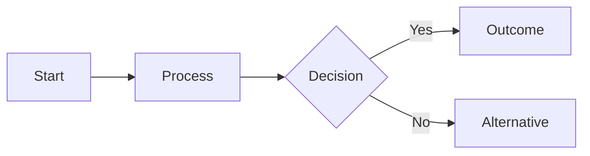
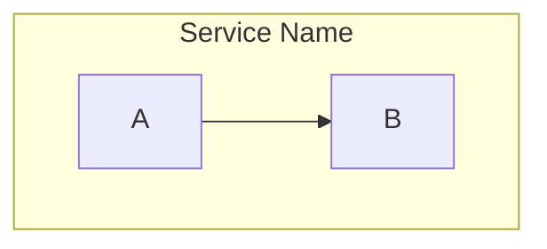

# Mermaid Flowchart Reference

## Basic Syntax

## Node Shapes (v11.3+)

| Shape | Syntax | Description |
|-------|--------|-------------|
| Rectangle | `A[text]` | Default process node |
| Rounded | `A(text)` | Start/end |
| Stadium | `A([text])` | Terminal |
| Subroutine | `A[[text]]` | Predefined process |
| Cylinder | `A[(text)]` | Database |
| Circle | `A((text))` | Junction/connector |
| Asymmetric | `A>text]` | Output |
| Parallelogram | `A[/text/]` | Input/output |
| Trapazoid | `A[/text\\]` | Input (reverse) |
| Hexagon | `A{{text}}` | Preparation |
| Diamond | `A{text}` | Decision |
| Double Circle | `A(((text)))` | Multi-junction |

## Link Styles

| Syntax | Description |
|--------|-------------|
| `A-->B` | Arrow |
| `A---B` | Line |
| `A--text-->B` | Arrow with label |
| `A-.->B` | Dotted arrow |
| `A==>B` | Thick arrow |
| `A--oB` | Open circle arrow |
| `A--xB` | X arrow |

## Subgraphs

## Styling

## C4 Workaround

See `references/c4-mermaid.md` for the flowchart-based C4 approximation pattern.
