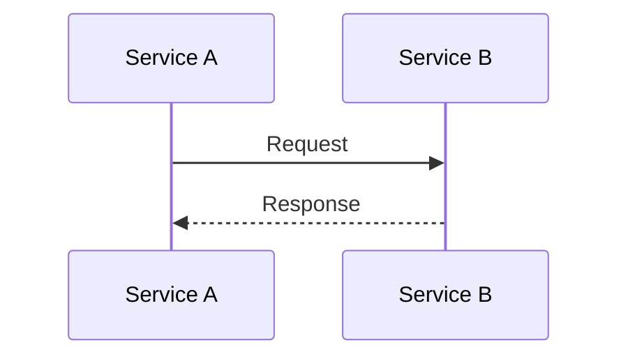
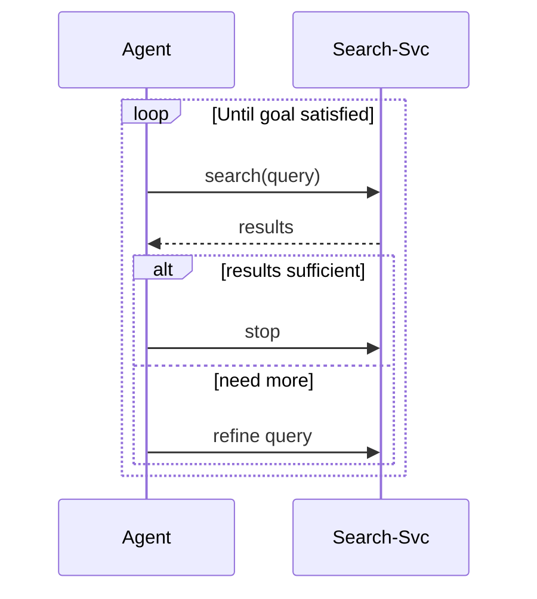
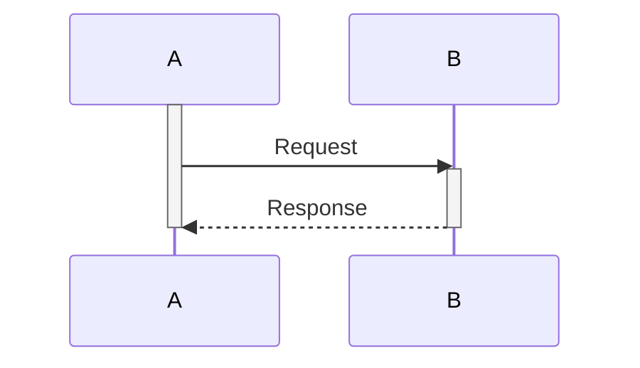

# Sequence Diagrams

Best for: interaction protocols, API call flows, agent handoffs, multi-service communication.

## Basic Syntax



## Participant Types (v11+)

```mermaid
sequenceDiagram
  participant A as 🧑 User
  participant G as ⚙️ API Gateway
  participant B as 🕸️ Browser
  database D as 📦 Database
  actor E as 🌐 External

  A->>G: scrape(url)
  G->>B: render(url)
  B->>D: cache result
  B-->>A: markdown
```

## Loops and Conditions



## Activation (Lifecycle)



## Critical Rules

- `activate`/`deactivate` must be balanced
- `alt`/`else`/`end` for conditional branches
- `loop`/`end` for iterations
- `par`/`and`/`end` for parallel
- `break`/`end` for exit conditions
- `critical`/`option`/`end` for critical sections
