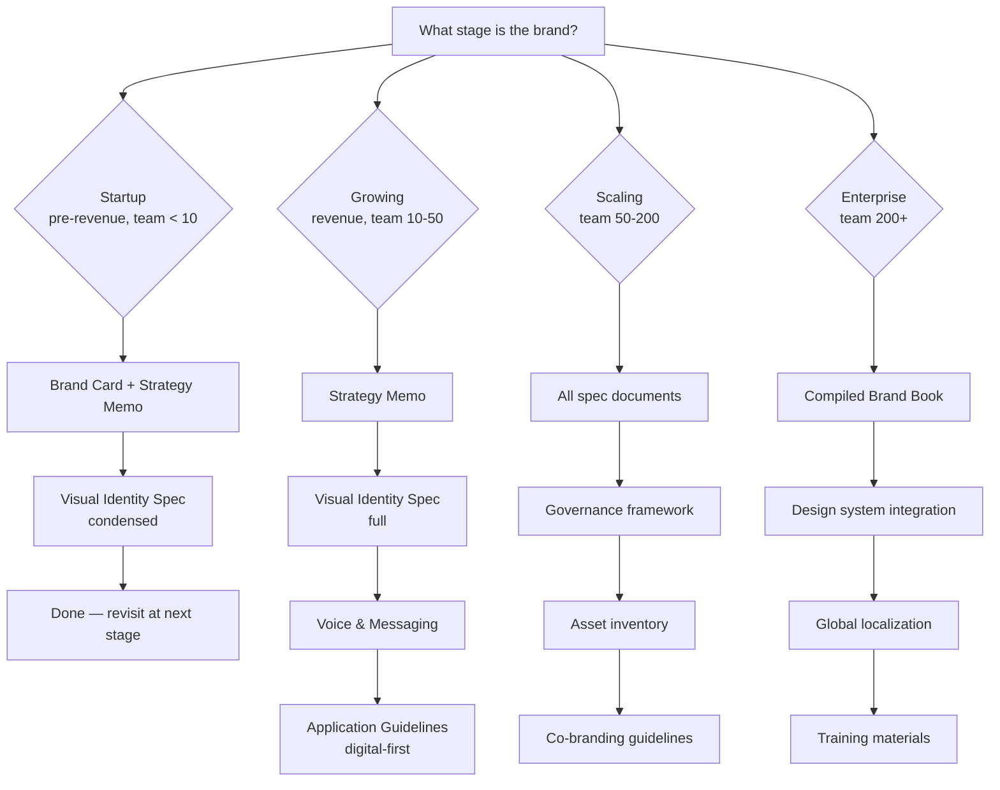

# Canonical Brand Identity Components

A definitive hierarchy of every component a brand identity can document, organized by maturity tier. Each component notes whether it's **required** (must document), **recommended** (should document), or **advanced** (document when scaling).

## Decision Tree

Which components to document depends on brand maturity:



## Component Hierarchy

### Tier 0 — Brand Card (visual summary)
*Required at any stage. The "elevator pitch" of the brand.*

| Component | What It Documents | Depth |
|-----------|------------------|-------|
| Brand name & tagline | Full name, shorthand, tagline/mission statement | One line each |
| Logo presentation | Primary logo on light + dark backgrounds | Image + brief specs |
| Color swatches | Core palette as visual swatches with names | 4-8 colors |
| Type specimen | Primary typeface shown in headline + body | One type family |
| Brand personality | 3-5 keywords describing the brand character | Keywords + one-liner |
| Reference image | A hero image that embodies the brand feel | Single image |

### Tier 1 — Strategy & Positioning
*Required for growing brands. Provides the "why" behind visual decisions.*

| Component | What It Documents | Required Fields |
|-----------|------------------|-----------------|
| Brand positioning statement | Audience, differentiator, market category | `positioning.audience`, `positioning.differentiator`, `positioning.market` |
| Brand personality (5-axis) | Traits along sincere/exciting/competent/sophisticated/rugged | `personality[5].axis` + `personality[5].value` |
| Mission & vision | Core mission statement and long-term vision | `mission`, `vision` |
| Core values | 3-5 values with descriptions | `values[].name`, `values[].description` |
| Competitive landscape | Key competitors and brand differentiation | `competitors[].name`, `competitors[].differentiator` |
| Target audience | Primary and secondary audience personas | `audiences.primary`, `audiences.secondary` |

### Tier 2 — Visual Identity (full spec)
*Required for any brand producing external materials. The "how it looks."*

#### Logo System
| Component | What It Documents | Required Fields |
|-----------|------------------|-----------------|
| Primary logo | Full-color horizontal logo | `file.svg`, `file.png`, `min-width` |
| Secondary logo | Stacked or condensed variant | `file.svg`, usage context |
| Icon / symbol | Standalone mark without wordmark | `file.svg`, min size |
| Monochrome variants | Black, white, grayscale versions | `file.svg` per variant |
| Clear space | Minimum empty area around logo | `value` in units of logo height |
| Minimum size | Smallest reproducible size per medium | `print`, `screen`, `social` |
| Background rules | Approved and prohibited backgrounds | `allowed[]`, `prohibited[]` |
| Incorrect usage | Visual "do not" examples | `misuses[].image`, `misuses[].note` |
| Favicon / app icon | Simplified mark for small contexts | `favicon.ico`, `apple-touch-icon` |

#### Color Palette
| Component | What It Documents | Required Fields |
|-----------|------------------|-----------------|
| Primary palette | Core brand colors | Per color: `hex`, `rgb`, `cmyk`, `pantone` |
| Secondary palette | Supporting accent colors | Per color: `hex`, `rgb`, `cmyk` |
| Functional palette | UI states (success, error, warning, info) | Per color: `hex`, `role` |
| Neutral palette | Grays, blacks, whites | Per shade: `hex`, `usage` |
| Dark mode adaptation | Adjusted palette for dark backgrounds | Per color: `hex` (dark) |
| WCAG contrast pairs | Color combinations that meet AA/AAA | `foreground`, `background`, `ratio`, `level` |
| Usage rules | Which colors for which contexts | Per color: `role`, `max-area` |

#### Typography
| Component | What It Documents | Required Fields |
|-----------|------------------|-----------------|
| Primary typeface | Main brand font | `family`, `weights[]`, `license` |
| Secondary typeface | Supporting font for body/code | `family`, `weights[]`, `fallback` |
| Type scale | Size/line-height/tracking per level | `levels[].name`, `font-size`, `line-height`, `tracking` |
| Hierarchy roles | Which type level for heading/body/caption | `role`, `type-level`, `usage-context` |
| Web fallbacks | System font stack | `font-stack` |
| Licensing | Font source and license type | `foundry`, `license-type` |

#### Iconography (recommended)
| Component | What It Documents | Required Fields |
|-----------|------------------|-----------------|
| Icon style | Stroke weight, corner radius, filled/outlined | `stroke-width`, `corner-radius`, `style` |
| Grid system | Base grid size, padding | `grid-size`, `padding` |
| Metaphor rules | How abstract concepts map to icons | `rules[]` |
| Accessibility | Minimum touch target, contrast | `min-touch`, `min-contrast` |

#### Photography & Imagery (recommended)
| Component | What It Documents | Required Fields |
|-----------|------------------|-----------------|
| Visual narrative | Subject matter, mood, lighting | `subject-matter`, `mood`, `lighting` |
| Color grading | Filter, temperature, saturation | `lookup-table` or `description` |
| Framing rules | Composition guidelines | `rules[]` |
| Diversity standards | Representation requirements | `guidelines` |
| Anti-patterns | What to avoid in imagery | `prohibited[]` |

#### Illustration Style (advanced)
| Component | What It Documents | Required Fields |
|-----------|------------------|-----------------|
| Art style | Medium, linework, coloring | `description` |
| Palette constraints | Colors allowed/forbidden | `allowed-colors[]`, `forbidden-colors[]` |
| Detail level | Minimal vs. detailed | `scale 1-5` |
| Tone | Whimsical, serious, technical, etc. | `descriptors[]` |

### Tier 3 — Voice, Tone & Messaging
*Required when multiple people write for the brand.*

| Component | What It Documents | Required Fields |
|-----------|------------------|-----------------|
| Voice attributes | 3-5 defining voice traits | `attributes[].name`, `attributes[].description` |
| Tone matrix | How tone shifts by context and audience | `matrix[].context`, `matrix[].audience`, `matrix[].tone` |
| Messaging pillars | Core message categories | `pillars[].name`, `pillars[].description` |
| Vocabulary | Approved terms, forbidden terms | `approved[]`, `forbidden[]` |
| Good/bad copy examples | Before/after for common scenarios | `examples[].scenario`, `examples[].bad`, `examples[].good` |
| Localization notes | Cross-market adaptation rules | `rules[]` |

### Tier 4 — Application Guidelines
*Required for any brand that appears across multiple channels.*

| Component | What It Documents | Required Fields |
|-----------|------------------|-----------------|
| Digital applications | Social media, email, website | Per channel: `templates[]`, `specs` |
| Print applications | Business cards, letterhead, signage | Per medium: `templates[]`, `specs` |
| Co-branding rules | Partner logo usage | `rules[]`, `examples[]` |
| File format matrix | Which format for which use | `deliverables[].format`, `deliverables[].usage` |
| Motion principles | Animation duration, easing | `principles[]` |

### Tier 5 — Governance & Maintenance
*Required for scaling/enterprise brands. The "how we keep it consistent."*

| Component | What It Documents | Required Fields |
|-----------|------------------|-----------------|
| Version numbering | MAJOR.MINOR.PATCH convention | `scheme` |
| Brand steward | Who owns the brand | `name`, `contact` |
| Review cadence | Scheduled review frequency | `frequency`, `trigger-events[]` |
| Exception process | How to request deviations | `process-steps[]`, `approval-chain` |
| Changelog | History of updates | `entries[].date`, `entries[].change` |
| Archive policy | How to retire old assets | `retention`, `disposal` |

### Tier 6 — Asset Inventory
*Required for any brand with >50 files.*

| Component | What It Documents | Required Fields |
|-----------|------------------|-----------------|
| Logo files | All variants with formats and paths | Per asset: `name`, `format[]`, `path`, `usage` |
| Color reference files | Swatch books, palette files | Per asset: `name`, `format`, `path` |
| Font files | Typeface files and licenses | Per asset: `family`, `format[]`, `path` |
| Icon sets | Icon libraries with format | Per asset: `name`, `count`, `format`, `path` |
| Illustration assets | Illustration libraries | Per asset: `name`, `style`, `path` |
| Photography | Photo libraries, stock sources | Per asset: `source`, `license`, `path` |
| Templates | Slide decks, email, social templates | Per asset: `name`, `tool`, `path` |
| Video assets | Brand videos, motion files | Per asset: `name`, `duration`, `path` |

## Component Relationships

Components are not independent — they reference each other:

```
Brand Card (Tier 0) ──sources from──▶ Strategy + Visual-ID + Voice
Strategy (Tier 1)    ──informs──▶ Visual-ID (Tier 2) + Voice (Tier 3)
Visual-ID (Tier 2)   ──feeds──▶ Application (Tier 4) + Image Generation
Voice (Tier 3)       ──feeds──▶ Application (Tier 4)
Application (Tier 4) ──uses──▶ Asset Inventory (Tier 6)
All tiers            ──governed by──▶ Governance (Tier 5)
```

## Component Maturity Model

| Brand Stage | Tiers to Document | Format |
|-------------|-------------------|--------|
| **Startup** (<10 people, pre-revenue) | Tier 0 + Tier 1 (condensed) | Brand card image + strategy memo |
| **Growing** (10-50 people, revenue) | Tier 0-3 | Full spec documents + brand card |
| **Scaling** (50-200 people, multi-channel) | Tier 0-5 | All specs + governance + compiled brand book |
| **Enterprise** (200+, global) | Tier 0-6 | Full system + asset inventory + localization |
