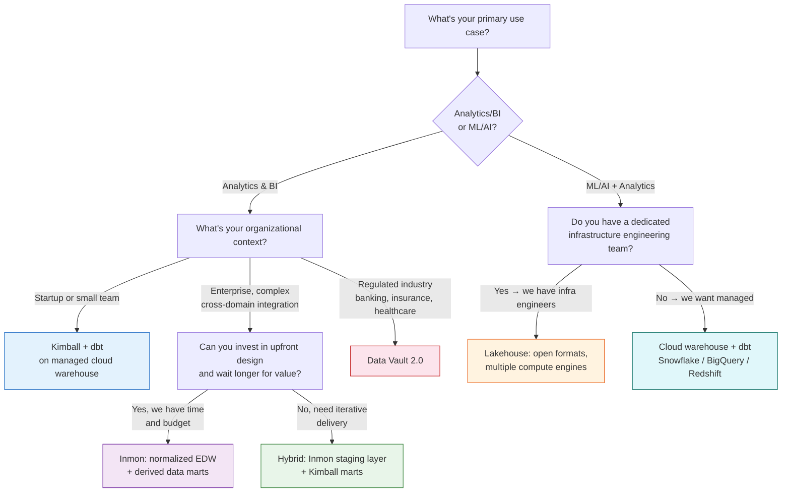
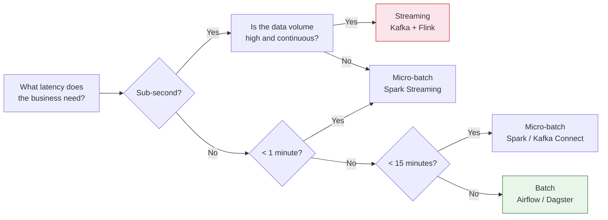

# Data Architecture Patterns — Decision Framework

A practical guide to choosing between the major data architecture patterns. Based on research from Ryan Kirsch, TalkingSchema, LinkedIn data architecture practitioners, and industry reference architectures.

## Decision Tree — Which Pattern to Use?



**Quick summary:**
- **Regulated, audit-heavy** → Data Vault 2.0
- **Startup, need speed** → Kimball + dbt
- **Enterprise, big investment** → Inmon or hybrid
- **ML + analytics from same data** → Lakehouse
- **Frequent source schema changes** → Data Vault

## Kimball (Dimensional / Bottom-Up)

**Philosophy:** Build data marts for individual business processes first. The enterprise warehouse emerges from integrating marts via conformed dimensions.

**Core artifacts:** Fact tables (measurements: revenue, clicks, orders) + Dimension tables (context: customers, products, dates) arranged in star schemas.

**Strengths:**
- Business users can query marts directly with minimal SQL
- Fast delivery — build one domain at a time
- Maps naturally to BI tool concepts (dimensions as filters, facts as measures)

**Weaknesses:**
- Conformed dimensions are hard to maintain as marts proliferate
- Inconsistent grain definitions across marts create data discrepancies
- Bottom-up can produce marts that are hard to integrate later for cross-domain questions

**When to choose:**
- Startup or small team building the first warehouse
- Business intelligence and reporting are the primary use case
- Need fast time-to-value per business domain
- Using modern tooling (dbt on Snowflake/BigQuery/Redshift)

## Inmon (3NF / Top-Down / Corporate Information Factory)

**Philosophy:** Design a normalized, subject-oriented, integrated enterprise warehouse first, then derive data marts as views or aggregates on top.

**Core structure:** Third normal form (3NF) — normalized to eliminate redundancy, subject-oriented (customer, product, transaction rather than source-system-oriented), integrated across all source systems.

**Strengths:**
- Genuine single source of truth enforced at the schema level
- Flexible — can answer questions not anticipated at design time
- Data quality and integration enforced centrally

**Weaknesses:**
- Upfront design effort is substantial
- Time-to-first-insight is much longer than Kimball
- Normalized schemas require complex queries for business users
- Iterative delivery is harder when everything flows from a central schema

**When to choose:**
- Enterprise with complex cross-domain integration requirements
- Data consistency is the highest priority
- Organization has the patience and resources for upfront design
- Regulatory environment demands strict auditability of data lineage

## Data Vault 2.0

**Philosophy:** Decompose every data entity into three types: hubs (business keys only), links (relationships between hubs), and satellites (descriptive attributes with full history).

**Core structure:**
```
hub_customer (customer_hk, customer_id, load_date, record_source)
hub_order (order_hk, order_id, load_date, record_source)
link_customer_order (customer_order_hk, customer_hk, order_hk, load_date)
sat_customer_details (customer_hk, load_date, name, email, segment, hash_diff)
sat_order_details (order_hk, load_date, status, amount, hash_diff)
```

**Strengths:**
- Extremely flexible to schema changes in source systems
- Complete auditability (every record has load date and source)
- Supports parallel loading (hubs, links, satellites load independently)
- Scales to massive heterogeneous data environments

**Weaknesses:**
- High structural complexity — raw vault is not queryable by analysts
- Most consumers need a "business vault" or information mart layer on top
- Tooling and expertise are less common than Kimball or Inmon
- Generally overkill outside regulated enterprise environments

**When to choose:**
- Regulated industry (banking, insurance, healthcare) with strict audit requirements
- Multiple heterogeneous source systems that change frequently
- Historical tracking and data provenance are legal requirements
- Organization has the expertise to operate it

## Lakehouse (Modern Synthesis)

**Philosophy:** Separate storage from compute using open table formats (Apache Iceberg, Delta Lake, Apache Hudi) on object storage (S3, GCS). Multiple compute engines (Spark, Trino, DuckDB, Snowflake, BigQuery) read from and write to the same storage.

**Layer structure:**
```
s3://data-lake/
  bronze/     # Raw, source-aligned (Inmon influence)
  silver/     # Cleaned, validated, integrated
  gold/       # Business-ready, query-optimized (Kimball influence)
```

**Strengths:**
- Decoupled storage and compute — pay for compute only when querying
- Multiple engines serve different use cases from the same data
- Open formats avoid vendor lock-in
- Layer structure combines Inmon's integration discipline with Kimball's query performance
- Serves both SQL analytics and ML pipelines from the same storage

**Weaknesses:**
- More moving parts than a managed warehouse (Snowflake, BigQuery)
- Operational complexity of managing object storage + table format metadata + multiple engines
- "Best of both worlds" marketing often undersells the engineering work required

**When to choose:**
- Team with significant unstructured/semi-structured data
- ML workloads alongside analytics from the same data
- Team has dedicated infrastructure engineers
- Need to avoid vendor lock-in at the storage layer

## Batch vs Streaming

### Decision Tree — When to Stream?



**Rule of thumb:** Start with batch. Only move to streaming when you have a concrete latency requirement that batch can't meet. "Real-time" is rarely worth the complexity premium.

### Batch (Airflow/Dagster scheduled jobs)
- **Strengths:** Simpler, cheaper, easier to reprocess, well-understood failure modes
- **Weaknesses:** Higher latency (minutes to hours), stale data between runs
- **When:** Reporting, ML training data, any scenario where sub-minute freshness isn't required

### Streaming (Kafka/Flink)
- **Strengths:** Real-time (sub-second), event-driven, supports reactive systems
- **Weaknesses:** Significantly more complex, harder to reprocess, state management challenges, expensive
- **When:** Fraud detection, real-time dashboards, operational alerts, event-driven microservices

### Micro-batch (Spark Streaming, Kafka Connect)
- **Strengths:** Sweet spot for most use cases — seconds to minutes latency without full streaming complexity
- **Weaknesses:** Not truly real-time, batch windows create artificial latency
- **When:** Most enterprise real-time use cases that don't need sub-second

**Rule of thumb:** Start with batch. Only move to streaming when you have a concrete latency requirement that batch can't meet. "Real-time" is rarely worth the complexity premium.

## Star Schema vs Snowflake Schema

### Star Schema
- Denormalized dimensions, fewer joins, simpler queries
- Better BI tool performance
- Preferred for analytics

### Snowflake Schema
- Normalized dimensions, saves storage, enforces integrity
- More complex queries, worse query performance
- Generally not worth the maintenance cost — star is almost always the right choice for analytics

**Verdict:** "Never! — I strongly believe the high maintenance of this outweighs any benefits compared to other methods." Use star schema for analytics. Use 3NF for operational/transactional systems.

## Decision Flow

1. **What's the primary use case?**
   - Analytics/BI → go to 2
   - ML/AI + analytics → lean Lakehouse
   - Transactional/operational → this is OLTP, not data warehousing

2. **What's the organizational context?**
   - Startup/small team → Kimball + dbt on managed cloud warehouse
   - Enterprise, complex integration, can invest upfront → Inmon or hybrid Inmon staging + Kimball marts
   - Regulated, audit-heavy → Data Vault 2.0
   - Has dedicated infra team, ML workloads → Lakehouse

3. **What's the data profile?**
   - Structured, predictable → any pattern works
   - Semi-structured, schema-on-read important → Lakehouse
   - Frequent source schema changes → Data Vault

4. **What's the team capability?**
   - Generalist data team → managed warehouse + Kimball
   - Strong engineering team with infra skills → Lakehouse or Data Vault
   - Small team, need speed → Kimball + dbt

## Source References

- Ryan Kirsch, "Data Warehouse Architecture Patterns: Kimball, Inmon, and the Modern Lakehouse" — practical comparison with code examples
- TalkingSchema, "Kimball vs Inmon vs Data Vault 2.0: Choose Like an Architect, Not a Fanboy" — decision framework with debunked myths
- Benjamin Tabares Jr., "Data Modelling Frameworks: Understanding Inmon, Kimball, and Data Vault"
- Blockmill, "OBT vs Star Schema vs Data Vault vs Inmon and more" — hybrid approach patterns
- LinkedIn Data Warehousing, "Comparing and Contrasting Three Data Warehouse Design Frameworks"
