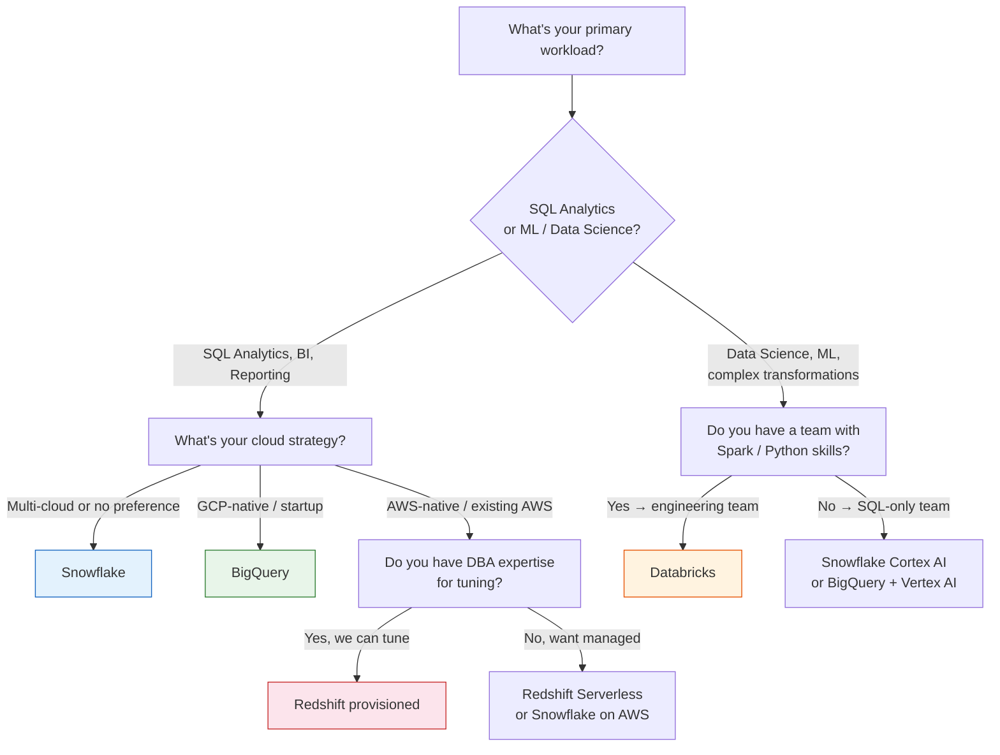

# Cloud Data Platform Comparison

A practical comparison of Snowflake, Google BigQuery, Amazon Redshift, and Databricks. Based on practitioner research, vendor documentation, and comparison guides from Reintech, Eidosoft, Improvado, Flexera, and Lakshmanan (ex-Google Cloud).

## Decision Tree — Which Platform to Choose?

**Quick summary:**
- **Don't know where to start?** → Snowflake. It's the safest default for most organizations
- **Already on GCP / startup** → BigQuery (zero ops, AI included)
- **Already on AWS with DBA staff** → Redshift (best price/performance at scale)
- **ML is as important as analytics** → Databricks (lakehouse, Spark-native)
- **Small team, want managed** → BigQuery or Snowflake

## Platform Comparison

### Snowflake

**Architecture:** Cloud-agnostic (AWS, Azure, GCP). Separates storage and compute completely — multiple virtual warehouses access the same data without copying. Proprietary storage layer.

**Pricing model:** Credit-based. Compute ($2-$6/credit depending on edition/region). Storage ($40/TB/month on-demand, $23/TB on capacity). Cloud services (free up to 10% of compute). Per-second billing with 60s minimum. Capacity contracts cut credits 20-30%.

**Scaling:** Spin up multiple warehouses of different sizes (XS through 6XL). Independent scaling for ETL vs analytics workloads. Auto-suspend and auto-resume. Multi-cluster warehouses for concurrency.

**Performance strengths:**
- Concurrent mixed workloads (100+ concurrent users)
- Data sharing across organizations (no data movement)
- Query performance on structured analytics
- Materialized views, search optimization, clustering

**Weaknesses:**
- Cost unpredictable — hidden costs from serverless features (materialized views, Search Optimization, Snowpipe), Cortex AI, Time Travel storage
- No native ML training (limited to SQL-based ML)
- Proprietary storage format (though now supports Iceberg writes)
- Frozen data costs for high-update tables

**Vendor lock-in vectors:** Proprietary storage format, unique SQL dialect, marketplace ecosystem dependency, data egress costs to migrate out. Iceberg support (2025) reduces lock-in.

**Best for:** BI-heavy teams, data sharing across business units, multi-cloud strategy, organizations that want managed service with minimal operational burden.

### Google BigQuery

**Architecture:** Fully serverless — no clusters to provision. Google's Dremel query engine with columnar Capacitor storage. Tightly integrated with GCP ecosystem.

**Pricing model:** On-demand ($5/TB queried, 1TB free/month) or flat-rate (slot-based reservations). Storage ($20/TB/month for active, $10/TB for long-term). Committed Use Discounts (CUDs) for predictable workloads. Gemini AI bundled at no extra cost.

**Scaling:** True auto-scaling — no manual sizing. Resources allocated per query. Slot reservations for predictable performance. Max number of concurrent queries based on slot pool.

**Performance strengths:**
- Ad-hoc analytics on petabyte-scale datasets
- Automatic optimization — no tuning required
- Streaming ingestion and real-time analytics
- Gemini AI (natural-language pipeline creation, visual data exploration)
- Multi-region replication

**Weaknesses:**
- Less control over resource allocation for complex queries
- No separation of compute for ETL vs analytics (everything shares slot pool)
- Query costs unpredictable for exploratory workloads
- Multi-region data transfer fees (starting Feb 2026)
- Weakest ecosystem outside GCP

**Vendor lock-in vectors:** Proprietary query engine, storage format coupling, strict GCP dependency for native integration. BigQuery Omni provides limited multi-cloud. Open-source connector ecosystems reduce but don't eliminate dependency.

**Best for:** GCP-native organizations, ad-hoc analytics, startups that want zero ops, ML/AI teams using Vertex AI integration, variable workloads that benefit from serverless.

### Amazon Redshift

**Architecture:** Columnar warehouse on AWS. Traditional provisioned clusters + Redshift Serverless (matured by 2026). RA3 nodes with managed storage separate from compute. Deep AWS integration.

**Pricing model:** Provisioned (pay per node-hour) or Serverless (pay per RPU-hour). RA3 pricing separates compute and storage billing. Spectrum queries data in S3 without loading. Reserved Instances for 1-3 year terms.

**Scaling:** Elastic resize (minutes) or classic resize (hours). Concurrency scaling for burst. Redshift Serverless auto-scales. Multi-dimensional data layouts (10x better price/performance on qualifying workloads).

**Performance strengths:**
- Massively parallel processing on huge datasets
- AQUA (Advanced Query Accelerator) for S3-based queries
- Zero-ETL integrations with 23 sources (PostgreSQL, DynamoDB, Salesforce)
- Materialized views, sort keys, distribution keys
- Redshift ML for SQL-based model creation

**Weaknesses:**
- Historically required significant tuning (sort keys, distribution styles, compression encodings)
- Workload management requires manual configuration
- Ecosystem less developed for ML/AI compared to Databricks
- Serverless is newer (less proven at extreme scale)
- Concurrency scaling costs add up

**Vendor lock-in vectors:** Deep AWS ecosystem integration, unique workload management model, Spectrum ties to S3. Migration-friendly via open formats (Parquet, Iceberg). AWS ecosystem lock-in is the real concern, not Redshift itself.

**Best for:** AWS-native organizations, high-performance BI on very large datasets, organizations that have DBA expertise for tuning, cost-sensitive workloads with predictable patterns.

### Databricks

**Architecture:** Lakehouse — combines data lake (cheap object storage, open formats) with warehouse (ACID, performance). Built on Apache Spark. Open table formats (Delta Lake, Iceberg, Hudi). Multi-cloud.

**Pricing model:** DBU-based (Databricks Units). Compute: $0.07-$2.00+/DBU depending on workload type (SQL, jobs, all-purpose) and tier. Storage charged separately by cloud provider (S3, GCS, ADLS). Serverless SQL warehouses available.

**Scaling:** Elastic auto-scaling for Spark clusters. Photon engine for accelerated SQL. Serverless SQL for BI workloads. Delta Sharing for cross-platform data access.

**Performance strengths:**
- ML/AI workloads alongside SQL analytics from same data
- Unity Catalog for unified governance across data + models
- Delta Lake for ACID transactions on data lakes
- Photon engine for performant SQL
- Model-agnostic approach (train any framework)

**Weaknesses:**
- Higher operational complexity than managed warehouses
- Requires Spark/Scala/Python skills beyond SQL
- Unity Catalog lock-in for governance (governance features not fully present in the open-source version)
- Cost tracking complex (DBU model + separate cloud infra costs)
- Cross-cloud management complex

**Vendor lock-in vectors:** Unity Catalog governance (open-source version is less capable), DBU pricing model makes total cost hard to compare, Delta Lake is open-source but Databricks-specific optimizations create gravity. Phoenix engine is proprietary.

**Best for:** Organizations with data science/ML workloads alongside analytics, teams with Spark/Python engineering skills, data platform teams wanting unified governance, anyone needing open table formats and avoiding proprietary storage.

## Side-by-Side: Decision Matrix

| Factor | Snowflake | BigQuery | Redshift | Databricks |
|---|---|---|---|---|
| **Ops burden** | Low | Lowest | Medium | Medium-High |
| **SQL-first** | Yes | Yes | Yes | Yes (Photon) |
| **ML/AI native** | Cortex AI | Vertex AI | Redshift ML | Native (Spark) |
| **Open formats** | Iceberg (2025) | No native | Parquet/Iceberg | Delta/Iceberg/Hudi |
| **Multi-cloud** | Yes (3 clouds) | GCP only | AWS only | Yes (3 clouds) |
| **Max concurrency** | Very high (multi-cluster) | High (slot pool) | Medium (WLM) | High (auto-scaling) |
| **Data sharing** | Native (marketplace) | Limited (authorized views) | Limited (datashare) | Delta Sharing |
| **Cost predictability** | Fair | Poor (slot/CUD helps) | Good (reserved) | Poor |

## Cost Warning Signs

**Snowflake:** Check for forgotten serverless features (materialized views, Search Optimization), Cortex AI line items, Time Travel on heavy-update tables, oversized warehouses.

**BigQuery:** Watch for runaway queries on large tables, no slot reservations for mixed workloads, multi-region transfer fees.

**Redshift:** Concurrency scaling costs, Spectrum data scan charges, resize downtime for provisioned clusters.

**Databricks:** DBU costs + separate cloud infra costs double the bill, all-purpose vs jobs vs SQL pricing tiers matter hugely, Photon vs non-Photon pricing difference.

## Sources

- Lakshmanan, "Snowflake or Databricks? BigQuery or Dataproc? Redshift or EMR?" (LinkedIn, 2022) — architecture philosophy framework
- Eidosoft, "Cloud Data Warehouse Comparison 2026" — comprehensive platform comparison with AI capabilities
- Improvado, "Snowflake Competitors in 2026" — decision rubric with migration guide
- Reintech, "Snowflake vs BigQuery vs Redshift 2026" — practitioner comparison
- Flexera, "Snowflake vs BigQuery: 7 Critical Factors" (2026)
- Definite, "Snowflake Pricing 2026" — detailed cost model analysis
