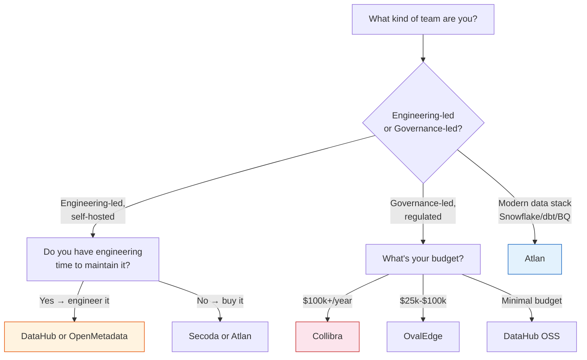

# Vendor Evaluation Framework

Structured comparison criteria for common data tool categories. Based on Atlan's buyer's guide, Improvado's enterprise data management analysis, and practitioner comparisons from Promethium, Basedash, and LinkedIn.

## Data Catalogs

### Decision Tree — Which Catalog Fits?

**Staffing warning labels:**
- **Collibra / Informatica** → needs dedicated data stewards or becomes shelfware
- **Alation** → needs 15+ active catalogers for ROI
- **DataHub / OpenMetadata** → needs engineering time to deploy and maintain
- **Atlan / Secoda** → lower staffing bar, designed to reduce curation effort

### Quick Comparison Table

| Tool | Best For | G2 Rating | Deploy Time | Starting Price | Staffing Required |
|---|---|---|---|---|---|
| **Atlan** | Modern data stacks (Snowflake, dbt, Databricks) | 4.5/5 | 4-6 weeks | Custom enterprise | Low — active metadata reduces curation |
| **Alation** | Analytics-first orgs; mixed legacy/modern | 4.4/5 | 6-12 weeks | Custom enterprise | 15+ active catalogers recommended |
| **Collibra** | Regulated enterprises, governance-led | 4.2/5 | 3-9 months | $100k+/year | Dedicated data stewards needed |
| **DataHub (LinkedIn)** | API-first, engineering teams, self-hosted | N/A | Self-hosted | Free + infra cost | Engineering team to deploy |
| **OpenMetadata** | Broad connectors, engineers + analysts | N/A | Self-hosted | Free + managed plan | Engineering team to deploy |
| **Microsoft Purview** | Azure-first orgs | N/A | Days to weeks | Azure consumption | Low if Azure-native |
| **Informatica IDMC** | Multi-cloud, 600+ integrations | 4.2/5 | 6-9 months | Custom enterprise | Large governance team |
| **Secoda** | Fast-growing modern-stack teams (5-50 users) | 4.5/5 | 1-2 weeks | ~$500/month | Minimal |
| **Apache Atlas** | Hadoop-centric platforms | N/A | Self-hosted | Free | Hadoop ops team |
| **OvalEdge** | Mid-market; $25k-$100k budget | 4.9/5 | 4-8 weeks | $25k-$100k/year | Moderate |

### Key Evaluation Dimensions

**1. Architecture**
- Is it API-first and extendable? (DataHub excels here)
- Does it use active metadata (query-parsed, continuously updated) vs passive (scheduled crawls)?
- Is the metadata layer open or proprietary?

**2. Lineage Depth**
- Column-level granularity (not just table-level)?
- Cross-platform lineage spanning dbt, Airflow, Spark, and BI tools?
- Automated vs manual lineage capture?

**3. Deployment Speed**
- Does it deploy in weeks or months? Real customer timelines (not vendor estimates)
- Self-hosted vs SaaS vs hybrid?

**4. Staffing Requirements**
- Some tools (Collibra) require dedicated stewards to get ROI
- Others (Atlan, Secoda) are designed to reduce curation burden through active metadata
- Open-source tools (DataHub, OpenMetadata) need engineering investment to operationalize

**5. Pricing Model**
- Per-user? Per-data-asset? Consumption-based? Enterprise contract?
- Hidden costs: professional services ($80k-$200k), custom connectors ($15k-$50k each), cloud egress

**6. Evaluation Questions by Profile**

*For modern data stack (Snowflake/dbt/BigQuery/Databricks):*
- Does the catalog natively parse dbt manifest files for lineage?
- Can it ingest from both warehouse AND transformation tool?
- How fresh is the metadata — real-time or batch?

*For regulated enterprise:*
- Does it support RBAC/ABAC at column level?
- Can it automate PII classification across all sources?
- Does it provide compliance audit trail export?

*For engineering-first team:*
- Is there a REST API or GraphQL endpoint for programmatic access?
- Can we build custom connectors?
- Is the metadata model extensible?

### Staffing Failure Thresholds
- **Collibra / Informatica:** Needs dedicated data stewards; without them, tools become shelfware
- **Alation:** 15+ active catalogers needed for ROI; under-resourced teams underutilize it
- **DataHub / OpenMetadata:** Requires engineering time for setup and maintenance; budget headcount, not just licensing
- **Atlan / Secoda:** Lower staffing bar — designed to reduce curation effort through automation

## ETL/ELT & Data Integration

| Tool | Best For | Pricing | Strength |
|---|---|---|---|
| **Fivetran** | Managed ELT, broad connector library | Usage-based ($0.25-$1.00+/MAR) | Zero-maintenance connectors, 500+ sources |
| **Airbyte** | Open-source ELT, custom connector needs | Free (OSS) + Cloud plans | 350+ connectors, open protocol |
| **dbt** | Transformation-as-code | Free core + Cloud ($100-$$$$) | The standard for analytics engineering |
| **Talend** | Traditional ETL with complex transformations | Per-core licensing | Broad on-prem connector support |
| **Informatica** | Enterprise data integration | Custom enterprise ($500k+) | 600+ certified connectors, mature governance |

### Key Questions
- Do you need managed or self-hosted? (Fivetran vs Airbyte)
- Is the primary need ingestion (move data) or transformation (shape data)? (Fivetran/Airbyte vs dbt)
- What's your source system diversity? (narrow = cheaper, broad = need broad connector coverage)
- What's your latency requirement? (batch ELT vs real-time CDC)

## Orchestration

| Tool | Best For | Language | Strength | Weakness |
|---|---|---|---|---|
| **Airflow** | Most common, broadest ecosystem | Python (DAGs) | Largest community, 1000+ providers | Complex, not idempotent by default, scheduler bottlenecks |
| **Dagster** | Developer experience, testing | Python (software-defined assets) | Better testing, asset-centric, type system | Smaller community, fewer integrations |
| **Prefect** | Cloud-native, serverless | Python (decorators) | Automatic retries, built-in observability | Fewer community providers than Airflow |
| **Mage** | Data platform teams, simple syntax | Python, SQL, R, YAML | Developer-friendly, built-in data integration | Newest, smallest ecosystem |

### Key Questions
- How important is community and ecosystem breadth? (Airflow)
- Do you want code-first or declarative?
- Is testing and local development a priority? (Dagster)
- Do you need serverless execution or run your own infra?

## Source References
- Atlan, "16 Best Data Catalog Tools in 2026: A Complete Buyer's Guide"
- Improvado, "15 Best Enterprise Data Management Tools for 2026"
- Promethium, "Data Governance Tools Comparison: Collibra vs Alation vs Atlan vs Purview" (2026)
- LinkedIn, "Top 5 Data Governance Tools Compared"
- Basedash, "Best Data Integration Tools Compared 2026"
