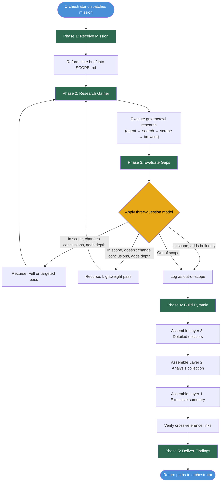

# Researcher Workflow — Decision Map

## Flow Notes

- Phases 1, 2, 4, and 5 are mandatory and sequential
- Phase 3 is the only branching point: can loop back to Phase 2 for recursion
- Recursion intensity ranges from lightweight (search only) to full pass (agent run)
- Maximum 2 recursion cycles before escalation
- Artifacts accumulate in `/tmp/researcher-workflow/<mission-slug>/`
- The pyramid is built from bottom up: dossiers → analysis → summary
