# Software Architecture Analysis — Codebase Reverse Engineering to Design Document

## When to Use

- A reference implementation exists and you need to understand its architecture for design inspiration
- You need a PRD, design document, or specification for a system in the same problem space
- The output must be **clean-room**: zero source code samples copied from the reference codebase
- You're designing a system with different architectural constraints (local-first, privacy-first, self-hosted) than the reference
- You need to extract an **implicit contract** — the storage operations a codebase performs — to design a formal provider abstraction

**Don't use for:** Direct code review, bug hunting, or security auditing (use a dedicated debugging skill instead). Simple tool or library evaluation (use a spike instead).

## Build Workflow

```
Phase 1: Clone + Map  →  Phase 2: Find Key Files  →  Phase 3: Map Architecture
                                                              ↓
Phase 6: Constraint Redesign  ←  Phase 5: Write Spec  ←  Phase 4: Feature Inventory
                                                              ↓
                                                      Phase 7: QA
```

## Phase 1: Repository Cloning and Structure Mapping

Clone the target repository with a shallow clone:

```bash
git clone --depth=1 https://github.com/owner/repo /tmp/target-repo
```

Map the top-level directory structure. For each directory, identify:
- What language/framework it uses
- Whether it's frontend, backend, service, firmware, or support
- Whether it's a core component (business logic) or support (CI, docs, tooling)

```bash
ls -la /tmp/target-repo/
find /tmp/target-repo -type f -name "*.swift" | sort   # or *.py, *.rs, *.ts, *.go
```

## Phase 2: Identify Key Architectural Files

Sort by line count to find the heaviest files — these carry the core logic:

```bash
wc -l /tmp/target-repo/**/*.swift /tmp/target-repo/**/**/*.swift 2>/dev/null | sort -n
```

Read the top 15-25 files, prioritized in this order:
1. **Entry points**: main, App, bootstrap — how the app boots
2. **Data models**: types that flow through the system
3. **Core services**: capture, processing, storage pipelines
4. **UI/page files**: feature surface from the user's perspective
5. **Configuration**: env files, config structs — external dependencies
6. **Privacy-sensitive files**: any service accessing user data

## Phase 3: Architecture Mapping

For each core service, identify:

- **What it captures**: data type, source, frequency, storage location
- **Where it processes**: local vs cloud, which APIs/services are called
- **Where it stores**: local database, cloud database, file system
- **External dependencies**: every third-party service, API key, cloud provider
- **Privacy profile**: what data leaves the machine, under what conditions

Build diagrams using Mermaid syntax (renders natively in GitHub and most markdown editors):

```mermaid
graph TD
    subgraph Capture["Capture Layer"]
        CAM[Camera/Mic Capture]
        FS[File Scanner]
    end

    subgraph Processing["Processing Layer"]
        OCR[OCR/NLP]
        STT[Speech-to-Text]
    end

    subgraph Storage["Storage Layer"]
        DB[(Local Database)]
        CLOUD[(Cloud Sync)]
    end

    CAM --> OCR
    FS --> OCR
    STT --> DB
    OCR --> DB
    DB --> CLOUD

    style Capture fill:#0a1a2e,stroke:#22d3ee
    style Processing fill:#0a2a1a,stroke:#34d399
    style Storage fill:#1a0a3a,stroke:#a78bfa
```



Use subgraphs for cloud/local boundaries. All diagram code blocks MUST use ` ```mermaid ` — never ASCII box drawing, never image files.

## Phase 3b: Interface Extraction Pattern (DAO/Provider Contract Design)

When the goal is to extract an **implicit contract** — what operations does this codebase need from its database or storage layer? — follow this variant:

### Step 1 — Read the philosophy first

Before touching code, read any PHILOSOPHY.md, DESIGN.md, ARCHITECTURE.md, or main README. These contain the design constraints the interface must respect. For example, the cashew thought-graph library's PHILOSOPHY.md says "dumb graph, smart reasoning layer" — edges carry no type labels, node types are descriptive hints for the LLM, not load-bearing for graph engine operations. That constraint must be baked into the contract.

### Step 2 — Catalog every storage operation

Read every file that touches the storage layer (database, filesystem, external service). For each file, list every distinct operation:

| Category | Example Operations |
|----------|-------------------|
| Node CRUD | create, read, update, delete, scan, count |
| Edge CRUD | create_edge, get_neighbors, delete_incident |
| Vector KNN | find_similar, set_embedding, delete_embedding |
| Graph Traversal | bfs, shortest_path, trace_derivation |
| Maintenance | similarity_candidates, random_sample, get_metrics |
| Transactions | begin, commit, rollback |

Target files by naming convention: `db.py`, `store.py`, `storage.py`, `embedding.py`, `session.py`, `persist.py`, and any batch/maintenance modules.

### Step 3 — Identify workarounds that signal boundary leaks

The code that exists *because of substrate limitations* rather than application logic. Signals:

- Dual-write patterns (same data to two tables for different query paths)
- Dimension-mismatch detection and fallback chains
- Full-table loads into numpy/scipy for operations a native substrate would support
- Recursive CTEs that reimplement graph traversal in SQL
- `try/except` switching between fast and fallback paths
- Comments like "needed because X doesn't support Y natively"

These workarounds are the **cost of the current boundary being in the wrong place**. They are candidates to move behind the contract.

### Step 4 — Design the contract from the catalog

Define the abstract interface (ABC, Protocol, or trait) capturing every operation from Step 2 without leaking substrate-specific details from Step 3.

**Design principles:**
- Design against what the codebase *needs*, not what the current substrate *does*
- Let the philosophy constrain the interface
- The expensive operations (similarity search, graph traversal, scanning) define the performance profile — the contract must make them implementable efficiently on a native substrate
- Transactions must be explicit

### Step 5 — Validate with a two-provider proof

Design a second provider implementation to test the abstraction. It doesn't need to be production-ready — it just needs to pass the same test suite. The two-provider proof catches:

- Operations too specific to the original substrate's semantics
- Missing operations the second provider would need
- Contract leaks (method signatures that assume SQL-like cursor behavior instead of returning data classes)

See [references/interface-extraction-pattern.md](references/interface-extraction-pattern.md) for a full worked example using the cashew thought-graph library — a real open-source project demonstrating all five steps.

## Phase 4: Feature Surface Inventory

Map every user-facing feature by reading UI view files, page files, and onboarding screens. Group by category:

- **Capture**: recording, scanning, import
- **Processing**: transcription, OCR, analysis
- **AI**: chat, assistants, insights, recommendations
- **Storage**: local, cloud, export
- **Integrations**: third-party services, APIs
- **Plugins**: extensions, custom tools, MCP

## Phase 5: Clean-Room Specification Writing

**This is the most critical phase.** The output document must:

1. **Describe architecture patterns** without quoting or reproducing source code
2. **Use natural language** to describe how components interact
3. **Reference the original codebase by architecture layer**, not by line numbers or variable names
4. **Never include source code snippets** — no Swift, Rust, Python, or any code from the reference. The spec is for *new* code, not a derivative work

**The "no contamination" principle:** If the output contains a code pattern recognizable from the reference, rewrite at a higher level of abstraction.

Structure the output with these sections:
- Product Vision and Design Principles
- Architecture Overview (Mermaid diagram)
- Functional Requirements (numbered)
- Non-Functional Requirements (performance, battery, privacy)
- Technical Architecture (component list with technologies)
- Plugin/Extension API Specification
- Privacy Architecture Detail (data flow map)
- Release Criteria (MVP → v1 → v2)

**Diagram rules:**
- All diagrams use ` ```mermaid ` code blocks — no ASCII box drawing, no image files
- Data flow diagrams should be separate Mermaid blocks per pipeline, not one monolithic diagram
- Every external dependency calls out its open-standard substitute (e.g., "OpenAI-compatible API, so any provider works")

## Phase 6: Breaking Constraints

When re-imagining the system under new design constraints (local-first, privacy-first):

1. Identify every mandatory cloud dependency in the reference architecture
2. For each, identify the local alternative (cloud API → local model, Firestore → SQLite, etc.)
3. For interfaces that support both local and cloud, specify the open standard (OpenAI-compatible API, S3-compatible storage, Whisper-compatible STT)
4. Where the reference used privacy-invasive patterns (browser cookie access, direct SQLite reads of other apps' data), call these out as **prohibited mechanisms** — the new design must use proper APIs (OAuth, platform APIs, official SDKs)

## Phase 7: Post-Delivery QA

After delivering the design document:

1. **Verify link integrity** — if your document references other design documents, ensure bidirectional links exist. Run a markdown link checker to catch broken references.
2. **Verify diagram rendering** — confirm all ` ```mermaid ` blocks render by checking no ASCII box-drawing characters (`┌`, `├`, `└`, `┐`, `┤`, `┘`, `┴`, `┬`, `┼`) remain in the output
3. **Check for code contamination** — scan for any inline source code snippets that look like they came from the reference. If found, rewrite at the architecture level
4. **Cross-reference audit** — every concept introduced in one section should be connected to its implementation in another. The document should be internally consistent

## References

- [references/interface-extraction-pattern.md](references/interface-extraction-pattern.md) — Full worked example of the Phase 3b interface extraction pattern, using the cashew thought-graph library (MIT, public on GitHub). Read when designing a provider abstraction or DAO contract for a codebase with a swappable storage backend.
